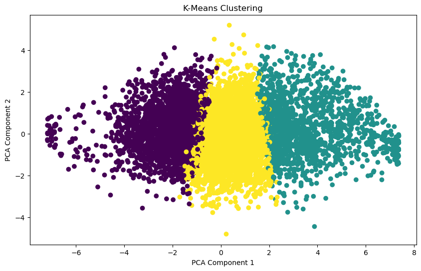
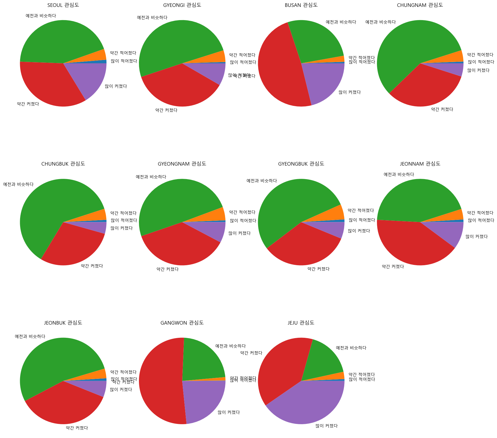
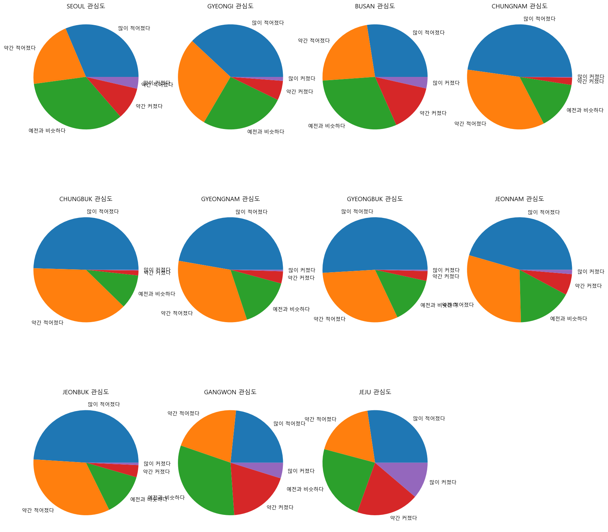
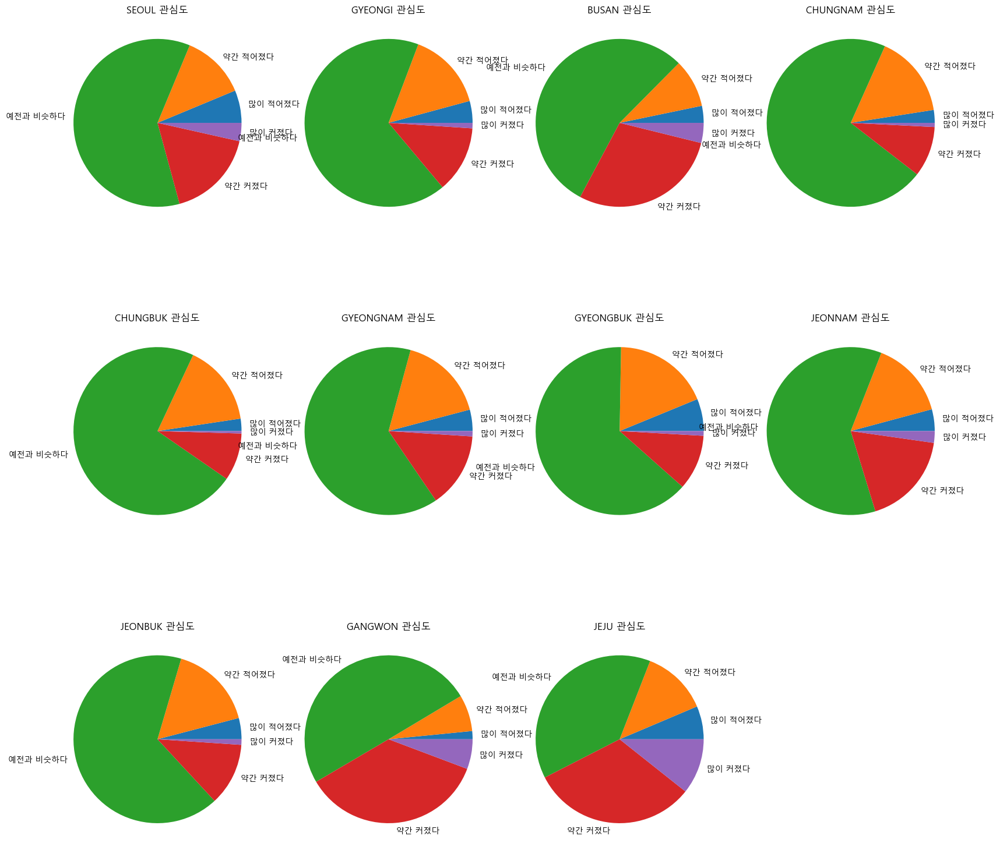

# Analysis_Domestic_Travel_Region_Interest
# 국내 여행 지역 선호도 분석

## Original Data(원본 데이터)
https://www.bigdata-culture.kr/bigdata/user/data_market/detail.do?id=359f0000-4129-11ec-a107-3b8bd6a15b10 
https://www.bigdata-culture.kr/bigdata/user/data_market/detail.do?id=b44da660-5892-11ec-8ee4-95f65f846b27 
Original data is not pre-processed

## EDA (탐색적 데이터 분석)
EDA_interest_final.ipynb, EDA_lodgment_final.ipynb에 진행과정이 나와있습니다.
1. 숙박 여행 유형 데이터

2. 국내 여행지역 관심도 데이터

## Data Pre-processing(데이터 전처리)
1. Feature's name is modified 
특성의 이름이 수정되어 있습니다 
2. Degree of Interest of Region is quantificated for Regression.(Pre-processing is not included) 
회귀를 위해 여행 지역 선호 정도를 수치화하였습니다 
original data: '많이 작아졌다', '약간 작아졌다', '예전과 비슷하다', '약간 커졌다', '많이 커졌다' 
pre-processed data: 0, 1, 2, 3, 4

## Modeling(모델링)
1. 숙박 여행 유형 데이터  
DecisionTree, GradientBoostingClassifier 이용하여 분석을 진행함  
2. 국내 여행지역 관심도 데이터  
K-Means Clustering, Deicision Tree, RandomForest, XGBoost 이용하여 분석을 진행함  
* K-means Clustering  

 * 각 군집별 성별, 나이, 응답지역, 가구소득의 분포  
   
 * 각 군집별 지역에 대한 관심도  
   
   
   

## 활용방안
국내 관광객 데이터를 활용한 여행지 선호도 분석 및 예측을 통해 소비자의 니즈에 적합한 여행지를 추천해주는 서비스를 제공할 수 있을 것이다.  
또한 여행 소비자를 정확히 타겟팅하여 코로나19 이후 주춤했던 국내 여행 감소를 해결하는 데 간접적으로 기여할 수 있을 것이다.  
   
## Overview
To analyze about region in Korea, we launched this project!
